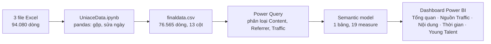
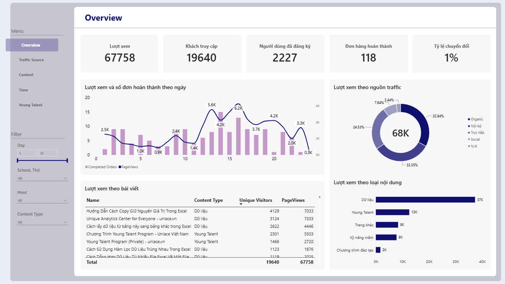
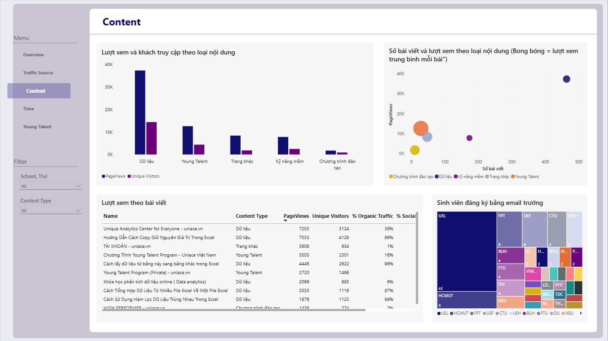
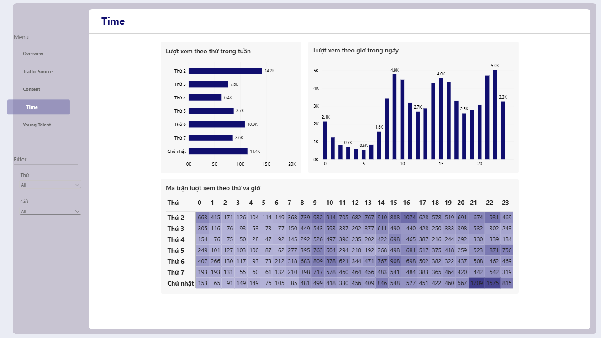

<div align="center">

# Uniace Website Traffic & User Behavior Analysis

### Phân tích traffic uniace.vn tháng 8/2021: nội dung nào kéo khách, kênh nào đưa khách, và khách hoạt động vào lúc nào


</div>

---

## Project Overview

Project bắt đầu từ 3 file Excel log tương tác của website [uniace.vn](https://uniace.vn), tổng 94.080 dòng, ghi lại từ 01/08/2021 đến 24/08/2021. Notebook Python gộp 3 file, chuẩn hóa cột ngày và xuất ra `finaldata.csv` (76.565 dòng). Mô hình dữ liệu và dashboard Power BI được xây trên file này.

Đề bài: phân tích dữ liệu truy cập và hành vi người dùng để đánh giá hiệu quả SEO và traffic, hiểu hành vi người dùng, và đề xuất chiến lược nội dung, quảng cáo phù hợp. Phần phân tích khóa Young Talent (nguồn vào theo từng trang, email nhắc nhở) và cách phân loại lại `Traffic Type` là sáng kiến cá nhân, nằm ngoài đề bài gốc.

**Các câu hỏi project trả lời:**
- Đợt tăng lượt xem giữa tháng đến từ nội dung hay kênh nào? _(Ban tăng trưởng)_
- Kênh nào kéo nhiều khách, và kênh nào kéo khách thực sự mới? _(Marketing, SEO)_
- Nhóm nội dung nào thu hút khách, và nên đầu tư sản xuất thêm loại nào? _(Ban nội dung)_
- Khách hoạt động vào khung giờ và thứ nào trong tuần? _(Marketing vận hành)_
- Khóa Young Talent thu hút khách bằng kênh nào, và email nhắc nhở có hiệu quả không? _(Ban đào tạo)_

## Table of Contents

- [Project Overview](#project-overview)
- [Project Highlights](#project-highlights)
- [Repository Structure](#repository-structure)
- [Raw Data](#raw-data)
- [Data Pipeline](#data-pipeline)
- [Semantic Model](#semantic-model)
- [Dashboard](#dashboard)
- [Key Findings](#key-findings)
- [Tech Stack](#tech-stack)

## Project Highlights

| Area | What this project does |
|---|---|
| Làm sạch dữ liệu | Gộp 3 file Excel, sửa ngày bị Excel đảo tháng, loại 17.515 dòng có ngày không đọc được |
| Phân loại dữ liệu | Tạo `Content Type`, `Referrer Type`, `Traffic Type`, `Customer Type` từ URL, tên trang và email bằng Power Query |
| Measure | 19 measure DAX: khách không trùng, tỷ trọng theo nhóm, phân tích email |
| Dashboard | 5 trang: Tổng quan, Nguồn Traffic, Nội dung, Thời gian, Young Talent |
| Phân tích sinh viên | Nhận diện sinh viên qua email trường (127 người), có ghi chú về mẫu nhỏ |
| Young Talent | Phân tích trang khóa học, nguồn vào và hiệu quả email nhắc nhở |

## Repository Structure

```
├── Clean data/
│   ├── UniaceData.ipynb        # Notebook gộp và làm sạch dữ liệu (xây trong quá trình làm)
│   └── finaldata.csv           # Dữ liệu sau làm sạch, gitignore (xây trong quá trình làm)
├── Raw data/                   # 3 file Excel gốc, gitignore (có sẵn từ đầu)
├── Document/
│   ├── Document.xlsx           # Data dictionary (có sẵn từ đầu)
│   └── Uniace_Campaign.xlsx    # Dữ liệu chiến dịch (có sẵn từ đầu)
├── Images/                     # Ảnh chụp các trang dashboard (xây trong quá trình làm)
├── PowerBI/
│   ├── Uniace.pbip             # Project Power BI (xây trong quá trình làm)
│   ├── Uniace.Report/          # Dashboard 5 trang, định dạng PBIR (xây trong quá trình làm)
│   ├── Uniace.SemanticModel/   # Mô hình dữ liệu và measure, định dạng TMDL (xây trong quá trình làm)
│   └── Theme.json              # Theme màu và font (xây trong quá trình làm)
├── UniaceAnalysis.docx         # Báo cáo phân tích chi tiết (bản Word)
└── README.md
```

## Raw Data

Dữ liệu là log tương tác của website uniace.vn trong 24 ngày, xuất thành 3 file Excel. Các file gốc và file đã làm sạch nằm ở `Raw data/` và `Clean data/`, không đưa lên repo vì chứa email và địa chỉ IP thật (đã thêm vào `.gitignore`).

| File | Số dòng |
|---|---|
| `Uniace_1.xlsx` | 50.919 |
| `Uniace_2.xlsx` | 23.385 |
| `Uniace_3.xlsx` | 19.776 |
| **Tổng** | **94.080** |

Mỗi dòng là một sự kiện: xem trang, mở hoặc click email, đăng ký, gửi form, hoặc identify. Các trường chính:

- `Type`: loại sự kiện, gồm `page` (xem trang), `templates_open` (mở email), `templates_click` (click link trong email), `list_addition` (thêm vào danh sách email), `identify`, `form`, `templates_unsubscribe`.
- `Name`: tên trang hoặc tên email, ví dụ `Young Talent 3 - uniace.vn` hoặc `young-talent-reactivate`.
- `Email`: email đăng nhập, `N/A` nếu khách ẩn danh.
- `MA Referrer`: URL của trang đứng trước, dùng để xác định nguồn traffic.
- `MA URL`: URL của trang được xem.
- `cuid`: mã trình duyệt. Khi không có, dùng `IP Address` thay thế để tạo `Visitor ID`.
- `Date`: thời điểm sự kiện.

**Xử lý dữ liệu chính trong `UniaceData.ipynb`:**
- Gộp 3 file Excel bằng `pd.concat`.
- Excel đọc chuỗi ngày kiểu `DD-08-2021` theo kiểu Mỹ, làm ngày và tháng bị đảo. Notebook nhận diện các dòng có ngày bằng 8 nhưng tháng khác 8, rồi đảo lại để về tháng 8/2021.
- Thử lần lượt nhiều định dạng ngày đã gặp trong dữ liệu. Dòng nào không khớp định dạng nào thì gán `NaT` và bị loại: **17.515 dòng (18,6%)** bị loại theo cách này, nên số liệu chỉ tính trên 76.565 dòng còn lại.
- Xuất `finaldata.csv`, 76.565 dòng, 13 cột.

Các bước phân loại trong Power Query (`finaldata.tmdl`):
- `Customer Type`: email chứa `edu` là **Sinh viên**, còn lại là **Normal**. Đây là cách xác định sinh viên duy nhất có được, nên chỉ nhận ra được khi khách đã đăng nhập bằng email trường.
- `School`: lấy domain sau `@`, bỏ tiền tố như `st.`, `student.`, viết hoa. Email không có trường đánh dấu `NOT STUDENT`.
- `Referrer Type`: 20 nhóm, xác định từ chuỗi trong `MA Referrer` (ví dụ `google`, `zalo`, `beacons`, `many.link`). Sự kiện có `Type` chứa `template` được gán là `Email`.
- `Content Type`: tên trang chứa `Young` hoặc `VYT` là **Young Talent**. Sự kiện không phải trang (`Type` khác `page`) hoặc trang tiện ích (tài khoản, checkout, chính sách...) là **Trang khác**. Phần còn lại chia thành Dữ liệu, Kỹ năng mềm, Chương trình đào tạo.
- `Traffic Type`: gom `Referrer Type` thành 5 nhóm: **Organic** (công cụ tìm kiếm), **Social** (Facebook, Zalo, Instagram, Tiktok, Youtube, link-in-bio, KOC), **Trực tiếp** (không có referrer), **Nội bộ** (từ một trang uniace.vn khác), **N/A**.
- `Hour`, `Day of Week` (Thứ 2 = 0, Chủ nhật = 6), `Thứ` (tên thứ bằng tiếng Việt).

## Data Pipeline



## Semantic Model

- `finaldata`: grain là một sự kiện tương tác (một lượt xem trang, một lần mở hoặc click email, một đăng ký, một lần identify). Đây là bảng duy nhất vì toàn bộ thông tin nằm trong một file log, không có bảng tra cứu riêng nên không tách star schema.
- `LocalDateTable` và `DateTableTemplate`: bảng ngày tự động của Power BI, không dùng trong báo cáo.

Có 19 measure trong bảng `finaldata`, không chia folder. 12 measure đang được dùng trực tiếp trên dashboard.

**Các measure phức tạp nhất:**
- `Unique Visitors`: `DISTINCTCOUNT` trên `Visitor ID`, bỏ dòng không có mã: đếm khách không trùng.
- `Completed Orders`: `DISTINCTCOUNT` trên `Email` của dòng `Completed Order`: số người mở email xác nhận đơn, không phải số đơn hàng.
- `% lượt xem` và `% số bài`: chia cho tổng các nhóm đang hiển thị (`ALLSELECTED` trên `Content Type`), cho tỷ trọng đúng khi có slicer.
- `Email Click Rate`: `Email Clicks / Email Opens`, tỷ lệ bấm link trong email.
- `Conversion Rate`: `Completed Orders / Unique Visitors`, hai measure đếm đơn vị khác nhau (người mở email và khách) nên chỉ là chỉ số tương đối.

## Dashboard

**1. Tổng quan**: 5 KPI (Lượt xem, Khách truy cập, Người dùng đã đăng ký, Đơn hàng hoàn thành, Tỷ lệ chuyển đổi), biểu đồ lượt xem theo ngày, hai biểu đồ cột xếp hạng theo `Traffic Type` và `Content Type`, và bảng Top 10 bài viết.



**2. Nguồn Traffic**: cột cụm lượt xem và khách truy cập theo `Traffic Type` (đã loại Nội bộ), biểu đồ xếp hạng Top 10 `Referrer Type`, và biểu đồ đường lượt xem theo ngày, mỗi `Traffic Type` một đường.


**3. Nội dung**: cột cụm lượt xem và khách truy cập theo `Content Type`, biểu đồ bong bóng số bài viết và lượt xem trung bình mỗi bài theo nhóm, và bảng bài viết kèm tỷ trọng Organic, Social, Trực tiếp.



**4. Thời gian**: cột chồng lượt xem theo ngày và `Content Type`, và ma trận `Thứ` × `Hour` tô màu theo lượt xem.



**5. Young Talent**: cột chồng lượt xem theo ngày và `Traffic Type` (lọc `Content Type` = Young Talent), ma trận Trang × Nguồn, và biểu đồ cột cụm email theo chiến dịch (mở và click).


## Key Findings

> **Lượt xem (PageViews)**: số dòng `Type = "page"`, không tính sự kiện email hay đăng ký.
>
> **Khách truy cập (Unique Visitors)**: số `Visitor ID` duy nhất. Khách ẩn danh đổi trình duyệt có thể bị đếm thành nhiều người.
>
> **Nội bộ**: lượt vào trang đến từ một trang khác của uniace.vn, không phải kênh kéo khách từ bên ngoài.
>
> **Trang khác**: trang tiện ích (tài khoản, thanh toán, chính sách) và các sự kiện không phải trang. Nhóm này bị loại khi phân tích nội dung.

**Insight từ dữ liệu:**
- Nhóm Dữ liệu chiếm hơn một nửa lượt xem (**55%**), lớn hơn tổng các nhóm còn lại cộng lại. Đây là trụ cột của website.
- Kỹ năng mềm có nhiều bài nhưng mỗi bài được xem ít. Phần lớn lượt xem tập trung ở một nhóm nhỏ bài: 10 bài đứng đầu chiếm **60%** lượt xem của nhóm nội dung.
- Young Talent chỉ có **4%** số bài nhưng nhận **21%** lượt xem, mỗi bài được xem gần **10** lần so với Kỹ năng mềm.
- Bài hướng dẫn Excel "copy giữ nguyên giá trị" có **96%** lượt xem đến từ tìm kiếm. Khách vào các bài Excel chủ yếu đến từ Google.
- Khóa Young Talent đến từ Social nhiều hơn hẳn toàn site: Social chiếm **36,7%** lượt xem của khóa học, trong khi toàn site chỉ **7,6%**.
- Lượt xem Young Talent có hai đợt. Đợt đầu (8-9/8) chủ yếu từ Social và hầu như không có email. Đợt sau có thêm Nội bộ và email nhắc, nên không thể quy cho một nguồn duy nhất.
- Email nhắc quay lại có lượt mở lớn nhưng phần lớn người mở không bấm link (tỷ lệ click **28%**). Người nhận đọc email nhiều hơn là hành động theo email.
- Khách chủ yếu xem một trang rồi rời đi (**43,6%**). Lượt xem trong ngày tập trung vào buổi tối, đỉnh lúc **22** giờ, và buổi sáng lúc **9** giờ.
- Chưa có dữ liệu giờ mua hàng và tên khóa học trong đơn. Trong **118** người mở email xác nhận đơn, **42%** từng tương tác với Young Talent, nên không xác định được bao nhiêu đơn đến từ khóa học.
- Số sinh viên đăng ký (**127** người) lớn hơn số sinh viên xem trang (**13** người). Nhận định về nội dung sinh viên chỉ mang tính gợi ý.

**Đề xuất hành động:**
1. Viết thêm bài hướng dẫn Excel và Power Query theo kiểu thao tác từng bước: nhóm Dữ liệu đang kéo phần lớn lượt xem, và các bài Excel là nơi tìm kiếm đưa khách đến nhiều nhất.
2. Đưa Young Talent vào kế hoạch đẩy qua Social, ưu tiên Facebook: khóa học nhận phần lớn khách từ Social, trong khi toàn site Social đóng góp rất ít.
3. Tách email nhắc quay lại theo hành vi (đã xem trang, đã mở nhưng chưa bấm) và so sánh tỷ lệ bấm giữa các nhóm: phần lớn người mở email không bấm link, nên cần thử nội dung nhắc khác cho từng nhóm.
4. Lấy dữ liệu thời điểm mua hàng trước khi chọn khung giờ chạy quảng cáo: giờ khách xem trang cao điểm chưa cho biết khi nào họ mua.

## Tech Stack

- **Python**
- **Power BI Desktop**
- **Git**
- **GitHub**
